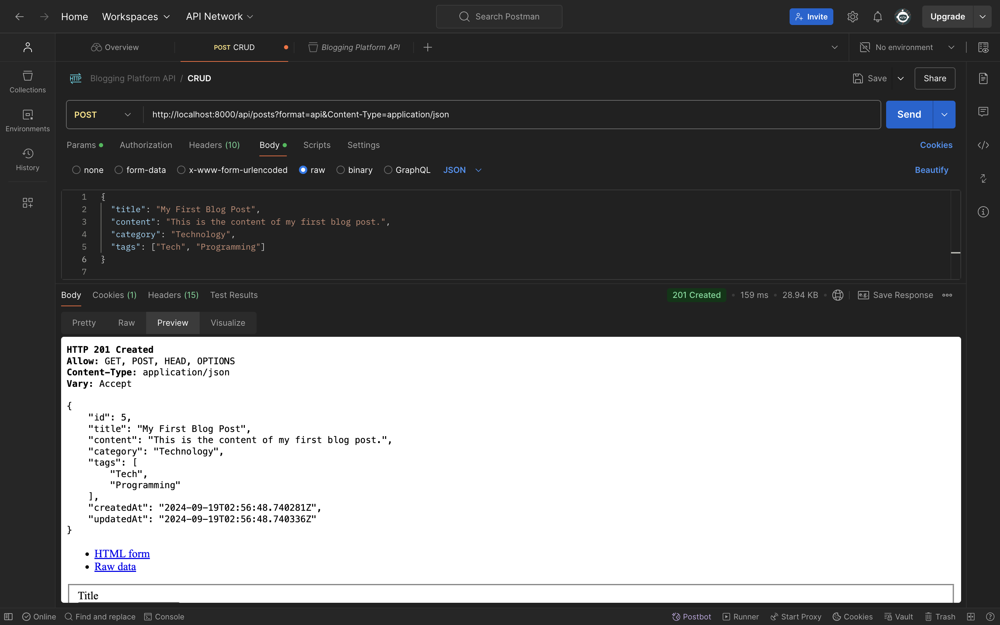
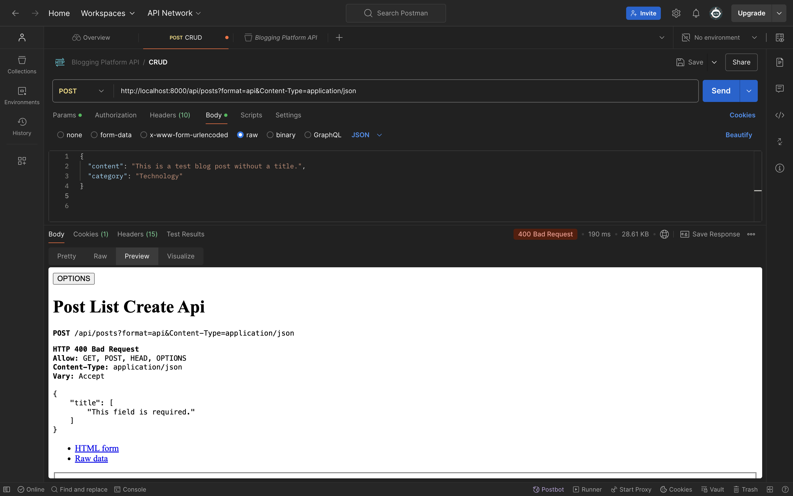
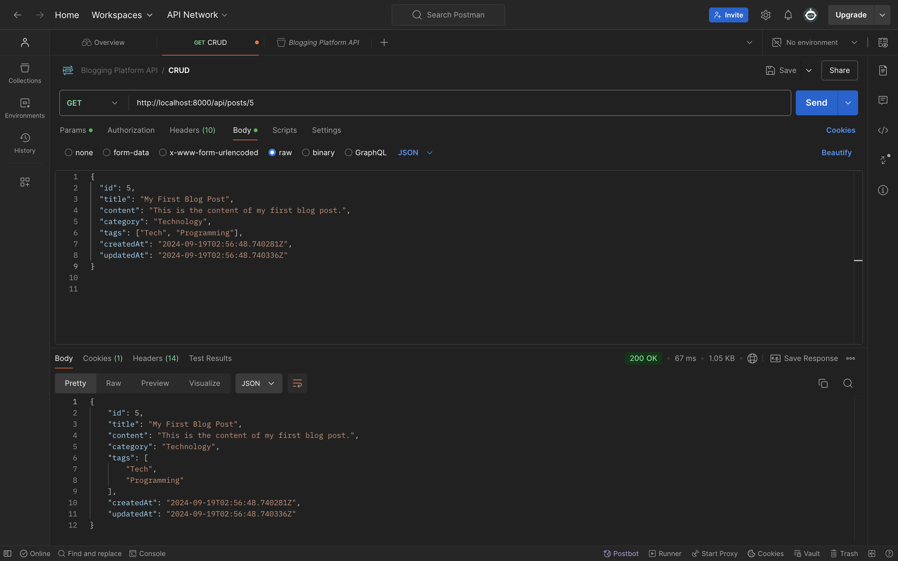
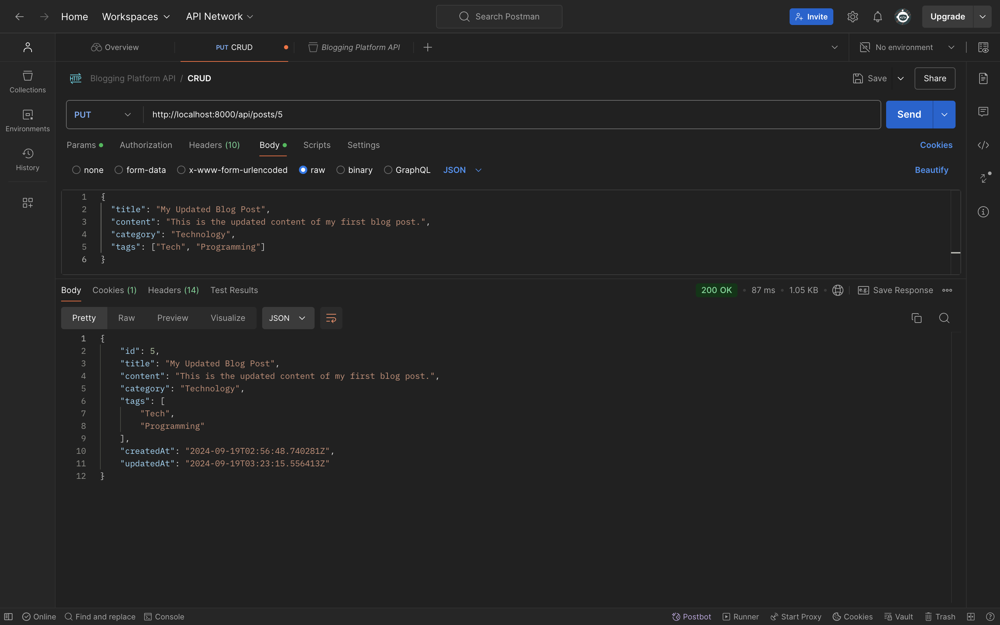
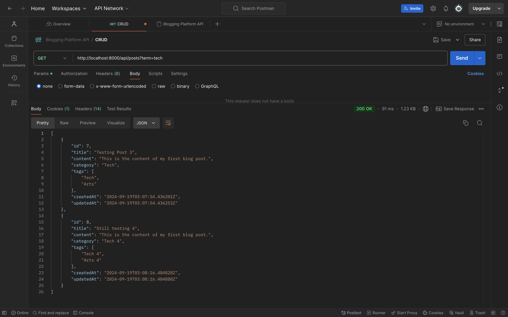
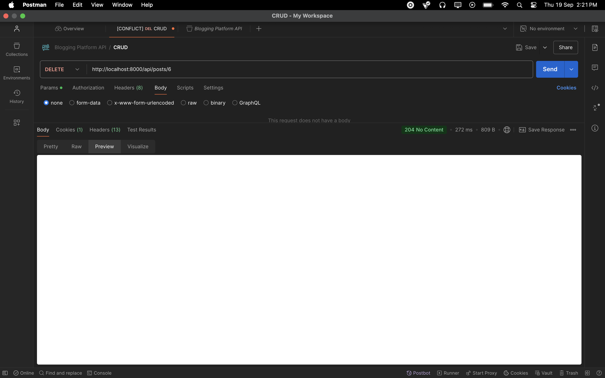
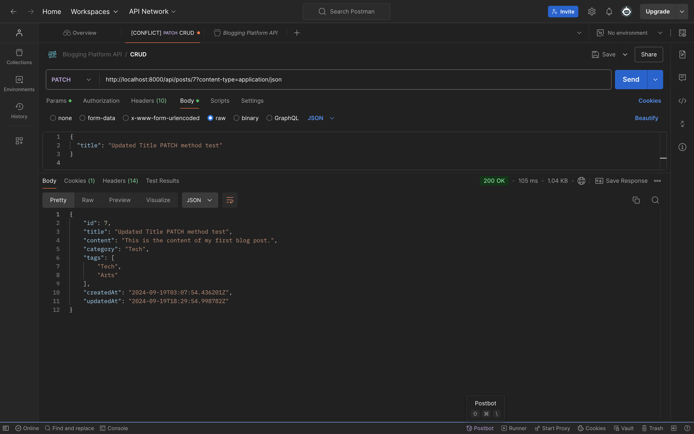

# 🚀 Blogging Platform API

> A simple and efficient Blogging Platform API built using **Cookiecutter Django** and **Django REST Framework**. Focused on CRUD operations to manage blog posts effortlessly.

## 🔥 Tech Stack

- **Cookiecutter Django**: I used Cookiecutter Django to streamline the setup for this project. It comes with Docker, PostgreSQL, and environment management already configured, which helped me get started quickly while learning how these pieces fit together.
- **Django & Django REST Framework**: For this project, I wanted to explore Django and Django REST Framework. They provided a solid foundation for building a functional API with clean code and fast performance.
- **PostgreSQL**: I chose PostgreSQL for its reliability and scalability, and this project gave me hands-on experience working with it.
- **Docker**: Using Docker ensured that the project environment was easy to manage and deploy, which made the development process smoother, especially for testing across different setups.
- **Postman**: I tested the API thoroughly with Postman to ensure everything worked as expected. This was part of my learning process for debugging and refining API endpoints.

- **Built for clarity**:  In line with the requirements of the technical test, this project focuses solely on the core API functionalities without implementing pagination, authentication, or authorization. This makes the code straightforward and easier to follow for testing and review.

## 💡 Key Features

### CRUD Operations:
- **Create**: Add new blog posts with title, content, category, and tags.
- **Retrieve**: Fetch specific blog posts or retrieve all available posts.
- **Update**: Edit existing blog posts to keep your content updated.
- **Delete**: Remove blog posts efficiently.

### Search & Filter:
- Search posts by title, content, or category using a simple query.

## 🔗 API Endpoints

- **POST** `/api/posts?format=api`: Create a blog post.
- **GET** `/api/posts`: Retrieve all posts.
- **GET** `/api/posts?term=tech`: Filter by a search term (`?term=search_term`).
- **GET** `/api/posts/<id>`: Get a single post by its ID.
- **PUT** `/api/posts/<id>`: Update an existing post.
- **DELETE** `/api/posts/<id>`: Delete a post by its ID.

## 🛠️ Setup & Installation

### 1. Clone the Repository:
```bash
$ git clone <repo-url>
$ cd blogging_platform_api
```

### Setting Up Environment Variables

1. Copy the example environment files:

```bash
$ cp .envs/.local/.django.example .envs/.local/.django
$ cp .envs/.local/.postgres.example .envs/.local/.postgres
```

.django 

### General
```bash
USE_DOCKER=yes
IPYTHONDIR=/app/.ipython
DJANGO_SECRET_KEY="your secret key"
```

.postgres 
### PostgreSQL

```bash
POSTGRES_HOST=postgres
POSTGRES_PORT=5432
POSTGRES_DB=blogging_platform_api
POSTGRES_USER=postgres_user
POSTGRES_PASSWORD=postgres_password
```


### 2. Build the Docker Images:

```bash
$ docker-compose -f docker-compose.local.yml build
```

### 3. Run the Application with Docker:

```bash
$ docker-compose -f docker-compose.local.yml up
```

### 4. Run Database Migrations:

```bash
$ docker-compose -f docker-compose.local.yml run --rm django python manage.py migrate
```
### 5. Create a Superuser:

```bash
$ docker-compose -f docker-compose.local.yml run --rm django python manage.py createsuperuser
```

### 6. Access the API:

Go to http://localhost:8000/api/posts/ or use Postman for testing.


## 🔧 Comprehensive Testing

Test the application thoroughly to ensure the functionality of all aspects of the API:
```bash
$ docker-compose -f docker-compose.local.yml run --rm django pytest blog/tests/test_create_post.py
$ docker-compose -f docker-compose.local.yml run --rm django pytest blog/tests/test_retrieve_post.py
$ docker-compose -f docker-compose.local.yml run --rm django pytest blog/tests/test_update_post.py
$ docker-compose -f docker-compose.local.yml run --rm django pytest blog/tests/test_delete_post.py
```

## 📸 API Testing with Postman

Here are some screenshots of the API being tested in Postman:

### 1. Creating a New Post


### 1.1 Bad Request 400 code creating a post
(This may occur when required fields are missing)



### 2. Retrieving a Post


### 3. Updating a Post


### 4. Search Term 


### 5. Delete a Post 204 no content 


### 6. Patch a Post
